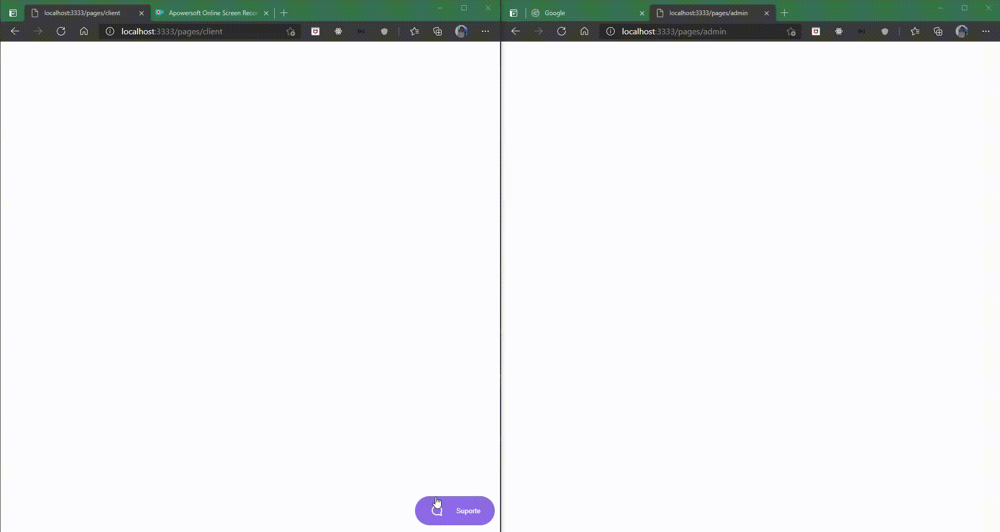

# :purple_heart: Chat Support

Este projeto é o resultado da 5° Edição da NLW#5 que foi ministrada pela Dani Leão, educator na Rocktseat.
É uma aplicação sobre um chat de atendimento realtime usando o protocolo Web Socket (WS).



# :rocket: Techs

- Para o servidor foi utilizado o ExpressJS
- Banco de dados usado foi o SQLite + TypeORM
- 90% do código escrito em Typescript
- Para o protocolo Web Socket foi utilizada a lib Socket.IO
- Renderizações de variáveis no HTML foram providas pela lib Mustache

# :electric_plug: Usage

Após clonar o repoistório e instalar as dependências, inicer o server com o script

```bash
yarn dev
```

As rotas a serem acessadas são:

- Para o cliente _/pages/client_
- Para o administrador _/pages/admin_
